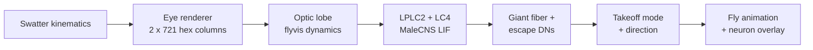
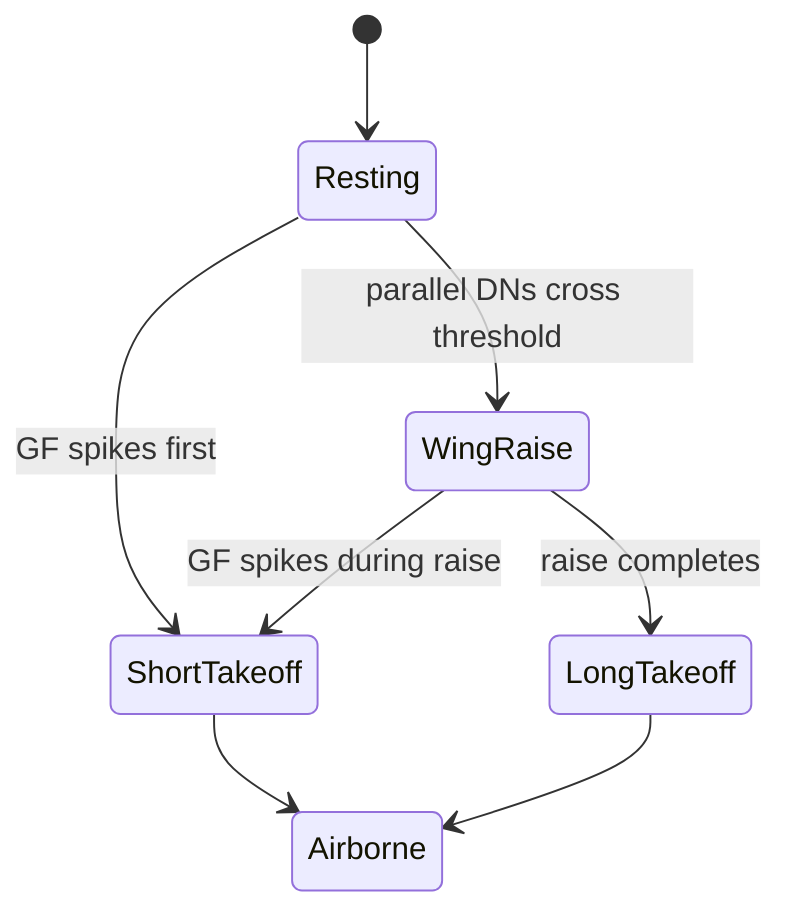

# SWATTER — Build Plan

Sep 24, 2026 · @Jhamura

## Overview

SWATTER is a browser game where you try to swat a fruit fly whose escape reflex runs on real connectome wiring. The fly sees your swatter as a looming object, its simulated escape circuit decides when and where to jump, and you learn — usually painfully — that its reflexes beat yours.

**What the player experiences**

- A fly sits on a surface in the centre of the screen. The cursor is a swatter.
- Move toward the fly and it watches you. Strike and it bolts, or it doesn't.
- After each round: did you hit, your approach speed, the fly's reaction time, and a replay of which neurons fired before it jumped.
- A global leaderboard ranks humans by swat rate.

**Why this, not another fly-plays-a-game demo**

Every viral MaleCNS project so far remaps the fly's neurons to keyboard keys for a human game, and the fly performs badly. SWATTER inverts it: the human plays, and the fly does the one thing its brain is superbly built for — detecting a looming threat and escaping it. The demo makes the fly look brilliant instead of useless, and the core number (escape latency) can be checked against published real-fly data.

## Scientific hook and success criteria

The project succeeds if the simulated fly's escape behaviour reproduces four known properties of real fly escape, without any hand-coded distance threshold.

The biology it rests on: a looming object activates LPLC2 neurons, which encode angular size, and LC4 neurons, which encode angular velocity. Both synapse directly onto the giant fiber (GF) descending neuron ([Ache et al. 2019](https://www.janelia.org/publication/neural-basis-for-looming-size-and-velocity-encoding-in-the-drosophila-giant-fiber-escape)). The timing of a single GF spike decides between a short-mode takeoff (under 6.87 ms, wings not raised, unstable) and a long-mode takeoff (wings raised, stable flight) ([von Reyn et al. 2014](https://www.nature.com/articles/nn.3741)). Faster looms push flies toward short takeoffs ([von Reyn et al. 2017](<https://www.cell.com/neuron/fulltext/S0896-6273(17)30474-9>)).

The standard lab stimulus is a disc of half-size r approaching at speed v, parameterised by r/v (ms), with t\_c the collision time:

```latex
\theta(t) = 2\arctan\left(\frac{r/v}{t_c - t}\right)
```

**Success criteria (all four must hold)**

| # | Criterion | Test | Pass condition |
| --- | --- | --- | --- |
| 1 | Looming selectivity | Expanding disc vs receding disc, equal-flux dimming, lateral translation | GF-proxy fires only for expansion |
| 2 | Size + velocity sum | Sweep r/v = 10, 20, 40, 80 ms | GF spike occurs at a consistent angular size; earlier in time for faster looms |
| 3 | Mode selection | Same sweep | Short-mode fraction rises as r/v falls |
| 4 | Direction | Loom from 8 azimuths | Takeoff heading biased away from the stimulus |

**Correction to the earlier chat estimate:** there is no single "\~200 ms reaction time" to match. Latency depends on loom speed, so it is reported per r/v and as the angular size at the moment of escape.

**Game-level target:** the fly escapes most swats but not all. Difficulty is tuned only in the stimulus mapping (Section 5), never by editing connectome weights.

## Landscape and positioning

The space is crowded with fly-plays-a-game demos; nobody has built a game where the fly's native escape reflex is the opponent.

| Date | Project | What it does | Gap SWATTER exploits |
| --- | --- | --- | --- |
| Sep 2026 | [DOOMFLY](https://retrogems.fr/en/simulated-fruit-fly-brain-plays-doom/) (Alex Wormuth) | MaleCNS drives Doom; frames become photoreceptor input, DNp20 rotates view, damage hits PPL101 dopamine cells | Fly survives seconds; task mismatched to fly circuits |
| Sep 2026 | [Mario 64 / Beat Saber](https://www.pcgamer.com/hardware/after-google-mapped-an-adult-male-fruit-flys-brain-software-engineers-made-it-play-doom-mario64-and-beat-saber/) | Connectome remapped to game controls; Beat Saber leans on RL and external note signals | Same key-remap genre |
| Sep 3 2026 | [MaleCNS v1.0](https://gizmodo.com/google-mapped-a-fruit-flys-brain-now-its-playing-doom-and-super-mario-64-2000808616) release | Brain + nerve cord, 166,700 neurons, 125M synapses | The dataset SWATTER uses |
| Mar 2026 | [Eon "uploaded fly"](https://eon.systems/updates/weve-uploaded-a-fruit-fly) | Shiu LIF brain model closed-loop with NeuroMechFly body | Criticised because the body model hides brain errors ([Carboncopies](https://carboncopies.org/Blog/Posts/FruitFlyNotUploaded/Post/)) |
| May 2025 | [Chai et al.](https://www.ncbi.nlm.nih.gov/pmc/articles/PMC12115834/) | Real flies with silenced GFs are caught more often by damselflies | The real-world experiment SWATTER mirrors, with a human as predator |

**Positioning line:** "Everyone made the fly play our games. We made you play its game — and it wins."

**Honesty guardrail, learned from Eon:** the escape decision must come from the neural simulation, and the UI must show it. The body animation only renders what the neurons already decided; it never corrects them.

## System architecture

The fly's brain runs as a three-stage pipeline in the browser: an optic-lobe model, a connectome-wired escape circuit, and a motor readout. The body animation only plays back what the readout decided.



Each stage feeds the next every simulation step; the game renders at 60 fps from the latest state.

**Stage-by-stage**

| Stage | Source | Size | Model type | Fitted parameters |
| --- | --- | --- | --- | --- |
| Eye renderer | Own code | 2 eyes x 721 columns | Geometry + luminance sampling | None |
| Optic lobe | [flyvis](https://github.com/TuragaLab/flyvis), ideally via the [MaleCNS port](https://github.com/Grigoriy-V/fly-brain) | \~31.5k units, 60 cell types, 1.35M edges (port) | Graded, pretrained, frozen | None |
| Looming detectors | MaleCNS v1.0 | LPLC2 + LC4 populations, both eyes | LIF, synapse count x predicted sign | One input gain from optic lobe |
| Escape decision | MaleCNS v1.0 | GF (DNp01) + parallel escape DNs | LIF | Global gain, threshold |
| Motor readout | Rule on DN spikes | n/a | GF spike timing → mode; left/right asymmetry → heading | None |

**Why flyvis stops short:** it models the optic lobe through the T4/T5 motion detectors ([Lappalainen et al. 2024](https://www.nature.com/articles/s41586-024-07939-3)). LPLC2 and LC4 are visual projection neurons downstream of it, so they come from the MaleCNS graph.

**The MaleCNS port matters.** A community repo already runs flyvis dynamics on MaleCNS wiring (721 hexagonal columns). Using it removes the female-template / male-connectome mismatch flagged in chat.

**Parameter freeze rule:** the three fitted numbers are set once, offline, against the lab stimuli in Section 2, then frozen. They are never tuned to make the game easier or harder.

**Runtime:** everything runs client-side (WebGPU, WASM fallback). Server round-trips would add tens of ms of jitter to the exact latency the project measures.

## Stimulus mapping

The cursor controls a 3D swatter above a 2D table; each fly eye samples that scene through its hexagonal lattice, so looming emerges from geometry rather than from a scripted trigger.

**World model**

- The screen is a top-down view of a table. The fly stands on it at a random position and heading each round.
- **Hover phase:** the swatter tracks the cursor at a fixed hover height. Moving it closer to the fly already changes its angular size, so a clumsy approach can spook the fly before any strike.
- **Strike phase:** mouse-down starts a vertical descent. Strike speed comes from cursor speed over the last 100 ms, so a flick is a fast strike.
- **Hit test:** the fly is hit if it is inside the swatter footprint when the swatter reaches the table, and it has not yet lost leg contact.

**Eye rendering, per simulation step**

1. Take each column's viewing direction from the flyvis lattice, rotated by the fly's current heading. Left eye and right eye are mirror images.
2. Ray-cast that direction against the swatter (a dark disc), the table (mid-grey texture) and the sky (bright).
3. Blur with a Gaussian acceptance angle of about one inter-column spacing.
4. Output 2 x 721 luminance values to the optic lobe.

The swatter is dark on a bright sky because dark looms are the classic escape trigger. A light swatter is a free control condition.

**Default parameters (fly-scale units)**

| Parameter | Default | Note |
| --- | --- | --- |
| Fly body length | 2.5 mm | Sprite scale reference |
| Swatter half-width r | 50 mm | Disc approximation |
| Hover height | 150 mm | Tunable for difficulty |
| Strike speed v | 0.6–5 m/s | From cursor flick; gives r/v of 10–80 ms, the lab range |
| Eye columns | 721 per eye | Matches flyvis lattice |
| Eye render rate | Optic-lobe step rate | See open question |

**Difficulty knobs (the only legal ones):** hover height, strike speed cap, swatter size, fly starting heading. All change the stimulus, none touch the brain.

**Open question:** flyvis's native integration step. If it is coarser than about 5 ms, the optic lobe runs at its native step and the LIF stages interpolate its outputs at 0.5–1 ms, because short-mode takeoff decisions live at millisecond scale.

## Escape circuit and motor output

The readout stops at descending-neuron spikes: the GF spike and a parallel escape pathway race, and their relative timing sets the takeoff mode, as in [von Reyn et al. 2014](https://www.nature.com/articles/nn.3741).

**Neurons pulled from MaleCNS v1.0**

| Population | Role | Input | Output |
| --- | --- | --- | --- |
| LPLC2 (both eyes) | Encodes looming angular size | T4/T5 and Tm types from the optic lobe | GF, other DNs |
| LC4 (both eyes) | Encodes looming angular velocity | Lobula inputs from the optic lobe | GF, other DNs |
| Giant fiber, DNp01 (pair) | Short-mode command | LPLC2, LC4 | Readout |
| Parallel escape DNs | Long-mode program | LPLC2, LC4 targets | Readout |

Parallel escape DNs are chosen by querying MaleCNS for the strongest DN targets of LPLC2 and LC4. Literature candidates such as DNp02, DNp04 and DNp11 must be confirmed in the data, not assumed.

**Mode rule**



Short takeoff completes in under 7 ms and tumbles. Long takeoff takes longer but flies straight. Long-mode duration is sampled from the published distribution, not invented.

**Heading:** v1 reads takeoff heading from left/right asymmetry in LPLC2, LC4 and DN activity, biased away from the stronger side. Real flies set heading through pre-takeoff leg posture, so this is labelled a simplification in the UI.

**Why not read out through the nerve cord in v1:** the GF drives the jump motor neuron largely through electrical synapses, which electron-microscopy connectomes record poorly. Propagating the spike through VNC chemical synapses alone would understate the fastest path. VNC readout is a stretch goal once v1 ships.

## Gameplay design

One round is one swat, lasting a few seconds; the post-round card shows exactly why the fly escaped or didn't, using its own neurons.

**Core loop**

1. Fly spawns at a random position and heading.
2. Player hovers, then strikes.
3. Simulation resolves: hit, short-mode escape, or long-mode escape.
4. Post-round card, then a 3-second slow-motion replay with the neuron overlay.

**Modes**

| Mode | Rules | Purpose |
| --- | --- | --- |
| Classic | 20 swats, score = hit rate | Leaderboard mode |
| Streak | Play until the fly escapes three times in a row | Retention |
| Lab | Player fires standard looms (fixed r/v, azimuth) at a tethered fly | Lets anyone reproduce Section 2 criteria in-browser |

Lab mode is the credibility feature. Sceptics can run the same stimuli neuroscientists use and watch the curves build live.

**Post-round card fields:** outcome, your strike r/v in ms, the fly's angular size of the swatter when GF fired, takeoff mode, and the margin in ms between takeoff and impact.

**Live overlay panel**

- Two hexagonal heatmaps: what each eye sees.
- LPLC2 and LC4 population activity, left vs right.
- GF membrane voltage with its threshold line.
- Parallel-DN integrator and a marker at the decision moment.

**Leaderboard integrity:** each run is deterministic from a seed plus the recorded cursor trace. The client submits seed and trace; a server re-simulates it and accepts the score only if it matches. The server is off the gameplay path, so it adds no latency.

**Deliberately left out:** fatigue, habituation or "fly learns your style". None are in the model, so none go in the game.

## Tech stack and repo structure

Python builds and validates the brain offline; a Rust/WebGPU engine runs the frozen brain in the browser; TypeScript draws the game.

| Layer | Choice | Why |
| --- | --- | --- |
| Connectome access | neuPrint client or MaleCNS bulk download | Access route to confirm in Week 0 |
| Optic lobe (offline) | flyvis + MaleCNS port, PyTorch | Pretrained, frozen |
| LIF reference (offline) | Own sparse PyTorch LIF | Fast sweeps on the DGX |
| LIF cross-check | Shiu et al. Brian2 model | Confirms own LIF matches the published model |
| Export | Sparse CSR, float16, JSON manifest | Small download |
| Browser engine | Rust → WASM, WGSL compute shaders | WebGPU fast path, WASM CPU fallback |
| Optic lobe (browser) | ONNX Runtime Web (WebGPU) first, hand-written WGSL if export fails | Fastest route to a working step function |
| Game + overlay | TypeScript, Vite, Canvas2D | No framework weight |
| Leaderboard | FastAPI + SQLite, re-sim via the same WASM build in Node | One engine for play and verification |

**Repo layout**

```
swatter/
  offline/
    fetch_malecns.py        # pull neurons + synapses
    extract_subgraph.py     # LPLC2, LC4, GF, escape DNs
    optic_wrapper.py        # flyvis on MaleCNS lattice
    lif.py                  # sparse LIF, reference
    loom_sweep.py           # Section 2 criteria + plots
    export.py               # CSR weights + manifest
  engine/                   # Rust -> WASM, WGSL shaders
  web/
    game/  overlay/  lab/
  server/                   # leaderboard + re-sim
  docs/validation.md        # plots vs published data
```

**Determinism note:** WebGPU float results can differ slightly across GPUs. Leaderboard verification compares outcomes (hit, mode, heading bin), not raw floats.

## Timeline

Six weeks solo, go/no-go on Oct 11, 2026, public launch on Nov 8, 2026. The chat estimate of four weeks left out Lab mode and verified leaderboards.

| Week | Dates | Focus | Deliverable |
| --- | --- | --- | --- |
| 0 | Sep 28 – Oct 4 | Data + environment | MaleCNS access working; LPLC2, LC4, GF, candidate DN IDs; subgraph file with neuron and synapse counts; flyvis port running |
| 1 | Oct 5 – 11 | Offline brain + **go/no-go** | Optic lobe on synthetic looms; LIF escape stage; criteria 1 and 2 plotted |
| 2 | Oct 12 – 18 | Mode + heading | Criteria 3 and 4 plotted; three fitted parameters frozen; validation plots v1 |
| 3 | Oct 19 – 25 | Browser engine | WASM/WebGPU step; parity with Python on 50 fixed stimuli; faster than real time on a mid-range laptop |
| 4 | Oct 26 – Nov 1 | Game | World model, eye renderer, core loop, post-round card, live overlay |
| 5 | Nov 2 – 8 | Ship | Lab mode, leaderboard with re-sim, demo video, repo public, launch thread |

**Go/no-go at end of Week 1**

| Outcome | Condition | Action |
| --- | --- | --- |
| Go | GF fires for dark expanding discs at r/v 10–80 ms; silent for receding, dimming, translating | Proceed as planned |
| Partial | Optic lobe carries motion signals, but point-neuron LPLC2 is not looming-selective | Replace LPLC2 with a radial-motion template over T4/T5 outputs; label it as a model component in the UI |
| No-go | Optic lobe outputs carry no usable looming signal | Rescope: drive LPLC2 directly from rendered angular size and velocity; ship as a GF-circuit game, not an optic-lobe one |

The partial path is the most likely outcome and still ships a strong project. Decide at the gate; do not start browser work before it.

## Validation and metrics

Five plots and four ablations go in `docs/validation.md` before launch; each ablation mirrors a published genetic-silencing result, so the simulated fly is tested the way real flies were.

**Plots**

1. GF voltage over time for r/v = 10, 20, 40, 80 ms, and angular size at GF spike vs r/v.
2. Selectivity: GF spike probability for expanding, receding, dimming and translating stimuli.
3. Short-mode fraction vs r/v, with the published trend overlaid qualitatively.
4. Polar histogram of takeoff heading relative to stimulus azimuth.
5. From game logs: escape probability vs human strike r/v. This is the human-vs-fly psychometric curve and the headline figure.

**Ablations**

| Condition | Published result | Expected in simulation |
| --- | --- | --- |
| LPLC2 silenced | Fewer GF-mediated escapes ([Ache et al. 2019](<https://www.cell.com/current-biology/fulltext/S0960-9822(19)30138-1>)) | Short-mode fraction drops |
| GF silenced | Flies caught more by damselflies ([Chai et al. 2025](https://www.ncbi.nlm.nih.gov/pmc/articles/PMC12115834/)) | Higher human hit rate, fast strikes especially |
| Shuffled LPLC2/LC4 → GF weights, degree-preserving | No published equivalent | Looming selectivity collapses |
| Distance-threshold bot replacing the brain | Baseline only | Escapes depend on distance alone, not strike speed; SWATTER's fly must differ |

**Two ablations ship as game modes:** "GF-silenced fly" and "Shuffled brain". Players feel the difference, and the hit-rate gap from thousands of games becomes a result in its own right.

**What is reported honestly as a limitation:** point-neuron LIF, no electrical synapses, heading from DN asymmetry, and any fallback taken at the Week 1 gate.

## Risks and mitigations

The biggest technical risk is LPLC2 selectivity; the biggest non-technical risk is the hype window closing before launch.

| Risk | Likelihood | Impact | Mitigation |
| --- | --- | --- | --- |
| Point-neuron LPLC2 is not looming-selective | High | High | Radial-motion template fallback, decided at the Week 1 gate |
| MaleCNS access or format friction | Medium | Medium | Week 0 is buffer; LPLC2, LC4 and GF also exist in FlyWire as a fallback, with the male/female seam documented |
| Cell-type names differ across MaleCNS, flyvis and papers | Medium | Medium | Match by type annotation; hand-check the GF, whose giant axon is unmistakable |
| flyvis step too coarse for ms decisions | Medium | Medium | Interpolate optic-lobe outputs into a 0.5–1 ms LIF loop |
| Browser too slow | Medium | High | Profile in Week 3; launch on desktop Chromium with WebGPU only; float16 weights |
| Leaderboard re-sim mismatch | Medium | Low | Compare outcomes, not floats |
| "It's faked" backlash, Eon-style | Medium | High | Lab mode, validation doc, open code, ablation modes, explicit limitations |
| Scope creep into the 3D flybody body | High | Medium | Strictly post-launch |
| Hype window closes before Nov 8 | Medium | High | Post a teaser at the Week 1 gate: the looming raster clip, to stake the idea publicly |

## Compute plan

This is a light-compute project: one A100 turns offline sweeps from hours into minutes, and play time runs entirely on the player's machine.

| Where | What runs | Rough size |
| --- | --- | --- |
| DGX, 1 x A100 | Loom sweeps, parameter fit, ablations, batched in PyTorch | \~12,800 trials (4 r/v x 8 azimuths x 4 stimulus types x 20 seeds x 5 conditions); minutes |
| DGX, CPU | MaleCNS extraction, graph stats | One-off |
| Player's browser | Full brain + game at play time | \~1.35M optic-lobe edges per step, plus a few thousand LIF neurons |
| Static host | Game bundle + weights | \~8 MB of weights at float16 with int32 indices, approximate |
| Small VPS or free tier | Leaderboard + Node re-sim | Only on score submission |

Figures are estimates from the port's published size, to be confirmed in Week 0.

**Do not** move the brain to the DGX for live play, even though it is available: it would reintroduce the network latency the design removes.

## Launch plan

Launch in three beats: a teaser at the gate, the game at launch, and a data follow-up a week later.

| Beat | When | Asset | Message |
| --- | --- | --- | --- |
| Teaser | Week 1 gate | 15 s clip: expanding disc → eye heatmap → LPLC2 → GF spike | "A fly brain deciding to escape. Soon you can try to swat it." |
| Launch | Nov 8 | 30–60 s video: swats, slow-mo neuron replays, the GF-silenced fly getting flattened | "Everyone made the fly play our games. We made you play its game — and it wins." |
| Follow-up | \~1 week after | Human-vs-fly psychometric curve; GF-silenced vs intact hit-rate gap | "N players, M swats: here's where human reflexes lose to 166k neurons." |

**Launch thread order**

1. Video.
2. What runs under the hood, in three lines.
3. What's real and what's modelled, stated plainly.
4. Lab mode link: "check it yourself".
5. Repo, validation doc, credits to MaleCNS, flyvis and the escape-circuit papers.

**After launch:** if the play data is clean, write it up as a short workshop paper in the next NeuroAI cycle.

## Sources

**Escape circuit**

- [Ache et al. 2019, looming size and velocity in the GF pathway](https://www.janelia.org/publication/neural-basis-for-looming-size-and-velocity-encoding-in-the-drosophila-giant-fiber-escape) ([full text](<https://www.cell.com/current-biology/fulltext/S0960-9822(19)30138-1>))
- [von Reyn et al. 2014, spike timing for action selection](https://www.nature.com/articles/nn.3741)
- [von Reyn et al. 2017, feature integration in escape](<https://www.cell.com/neuron/fulltext/S0896-6273(17)30474-9>)
- [Chai et al. 2025, GF escapes and damselfly predation](https://www.ncbi.nlm.nih.gov/pmc/articles/PMC12115834/)

**Models and data**

- [flyvis, Lappalainen et al. 2024](https://www.nature.com/articles/s41586-024-07939-3) · [code](https://github.com/TuragaLab/flyvis)
- [flyvis dynamics on MaleCNS wiring](https://github.com/Grigoriy-V/fly-brain)
- [MaleCNS v1.0 release coverage](https://gizmodo.com/google-mapped-a-fruit-flys-brain-now-its-playing-doom-and-super-mario-64-2000808616)
- [flybody](https://github.com/TuragaLab/flybody), for the post-launch 3D body
- [awesome-fly ecosystem list](https://github.com/cobanov/awesome-fly)

**Landscape**

- [DOOMFLY](https://retrogems.fr/en/simulated-fruit-fly-brain-plays-doom/) · [Mario 64 and Beat Saber](https://www.pcgamer.com/hardware/after-google-mapped-an-adult-male-fruit-flys-brain-software-engineers-made-it-play-doom-mario64-and-beat-saber/)
- [Eon, "We've uploaded a fruit fly"](https://eon.systems/updates/weve-uploaded-a-fruit-fly) · [Carboncopies critique](https://carboncopies.org/Blog/Posts/FruitFlyNotUploaded/Post/) · [LessWrong critique](https://www.lesswrong.com/posts/ybwcxBRrsKavJB9Wz/no-we-haven-t-uploaded-a-fly-yet)
