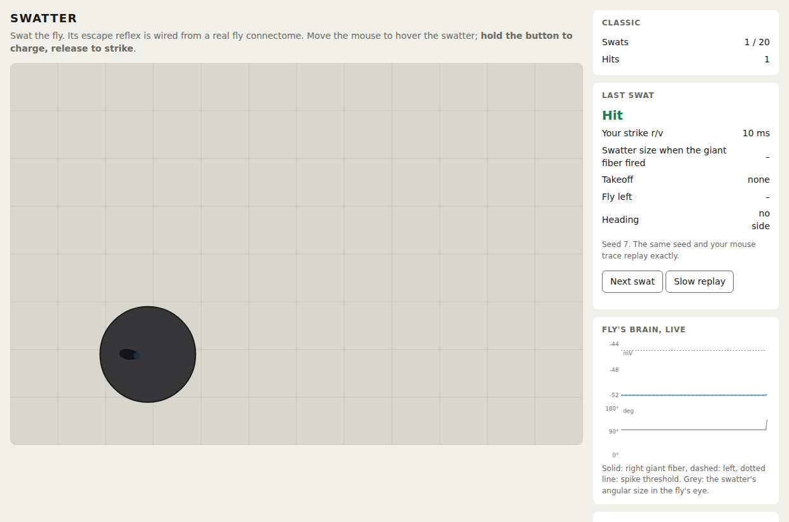
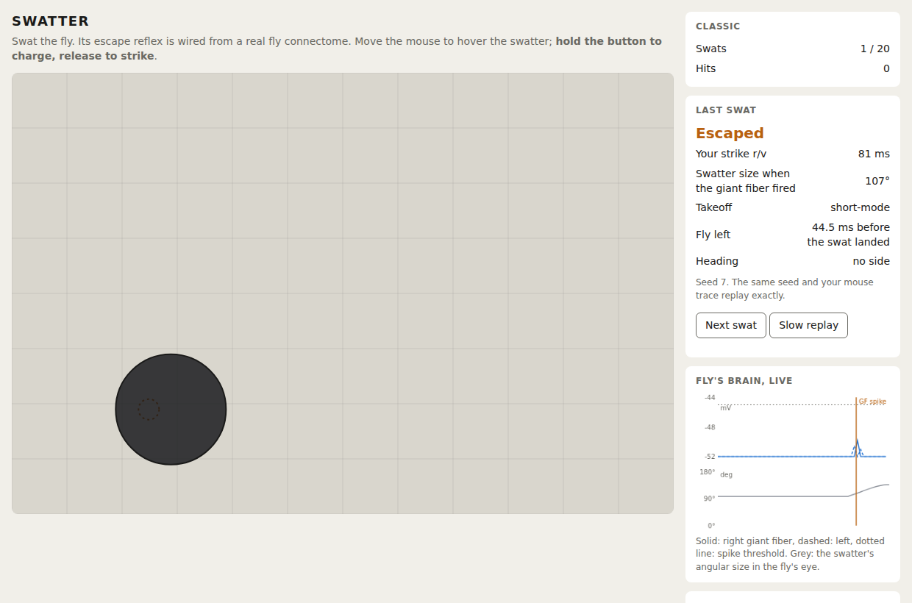
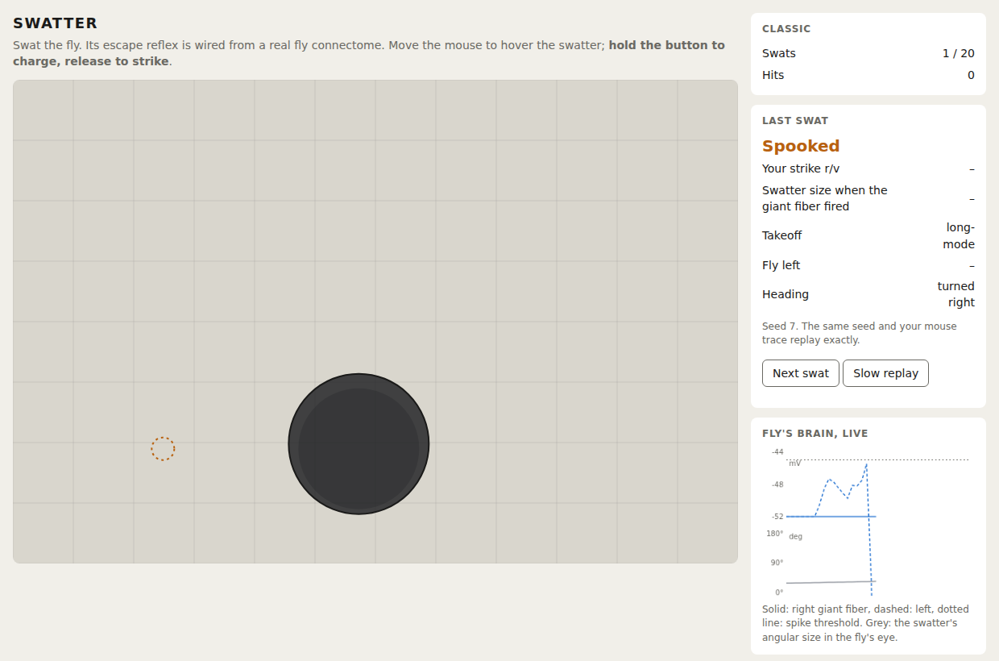
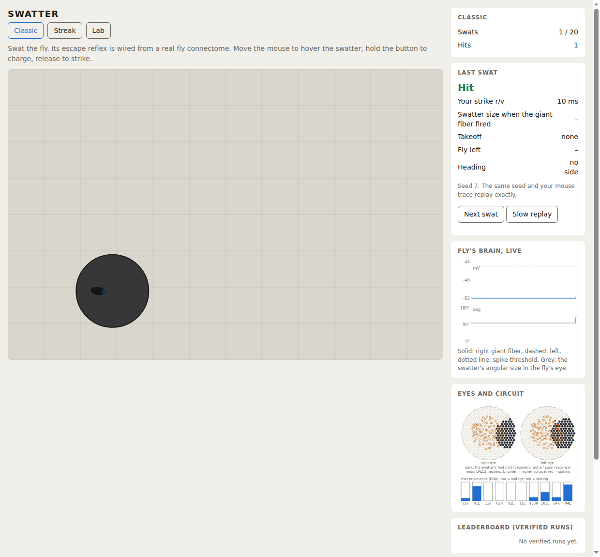

# Game world model (web/game) and what the frozen brain does to it

Status: the world model, a deterministic round simulator and a skill analysis exist and are tested
under Node against the real engine. A browser page (`web/index.html`) has three modes: **Classic** (20 swats,
score = hits, submittable to the leaderboard), **Streak** and **Lab**; plus the post-round card, a live
giant-fiber/angular-size overlay and slow replay. A Node leaderboard server replays submitted runs
(`server/`, below). The overlay has the plan's population panel (below). Not done: sound, a pixel scale tuned
by play, a touch layout beyond tap-and-hold, any human playtest.

## The finding that shaped the rules

Under the plan's rules the fly cannot be hit. The plan sets a 150 mm hover and takes strike speed from
the cursor's speed over the last 100 ms. With the frozen brain:

- The fly leaves 11 to 25 ms after the swatter starts to grow in its eyes (giant-fiber latency, plus the
  plan's 6.87 ms for a short takeoff). A strike from 150 mm at 5 m/s lasts 30 ms, so the fly is already gone
  at every speed in the plan's range. From a still hover, 24 of 24 strikes at every speed were escaped.
- A flick is a loom. To measure 3 m/s over 100 ms the cursor must travel 300 mm, and the swatter's approach
  over that stretch is what the fly sees, about 100 ms before the strike begins. Of the flicks tried
  (24 seeds, three approach directions, five flick lengths, hover heights 20, 40 and 150 mm) none produced a
  hit; the fly left during the approach or before landing. Pinned in
  `world.test.ts` ("the plan's own rules ... leave no strike able to land").

So the rules below are my decision, taken under "do whatever is best" and not the plan's. They are the
smallest change that gives a skill game, and they are easy to reverse (`CONFIG` in `world.ts`; the plan's
rules are still there as `strikeSpeedSource: "cursor"`).

| | Plan | Default here | Why |
| --- | --- | --- | --- |
| Hover height | 150 mm, "tunable" | **40 mm** | A strike has to cover the whole descent before the fly's 11 to 25 ms is up. 150 mm cannot, at 5 m/s. Hover height is one of the plan's four legal difficulty knobs. |
| Strike speed | cursor speed over the last 100 ms | **hold the button to charge, release to strike**, 0.6 to 5 m/s over a 1 s hold | The flick is detected before the strike. Charging keeps the plan's 0.6 to 5 m/s range, so r/v still spans 10 to 83 ms, the lab range. |

Both are stimulus-side choices; nothing touches the brain, as the plan requires.

## What the world does

Pure and deterministic: a round is a function of `(seed, cursor trace)`, with no clock and no
`Math.random`, so the leaderboard re-sim runs the same code. One tick is 5 ms.

- Fly: random position and heading from a seeded mulberry32. Eye 1 mm above the table.
- Swatter: a disc of half-width 50 mm. Hover phase: it tracks the cursor at the hover height. Strike phase:
  vertical descent at the charged speed, from the point where the button was released. The landing time is
  rounded to the engine's 0.2 ms step, so a strike's r/v is reported exactly as simulated.
- Frames: each tick the world computes the swatter's angular size 2 atan(r/D), its analytic growth rate (no
  finite-difference lag) and its position on each eye's plane, and hands them to the engine. The geometry is
  the same as `offline/heading.py`'s, pinned to it by `fixtures.json` (made by `offline/game_fixtures.py`).
- Takeoff: the plan's mode rule on the engine's spikes (`decideTakeoff`). Short: the giant fiber spikes
  first or within 6.87 ms of the parallel DNs, and the fly leaves 6.87 ms after the spike. Long: the raise
  completes without a giant-fiber spike, and the fly leaves at the end of the raise. Both 6.87 ms figures are
  the plan's single number for a short takeoff, not measurements of leg-contact loss (unverified), and they
  make the game slightly easier than a faster takeoff would.
- Outcome at landing: **hit** if the fly is inside the 50 mm footprint and has not left; **escaped** if it is
  inside and had left; **miss** if it was outside; **spooked** if it left during the hover; **timeout** after
  60 s. The card carries strike r/v, the swatter's angular size when the giant fiber spiked, takeoff mode,
  margin (landing time minus the time it left) and heading side.

## Skill curves (`web/game/difficulty.ts`, 12 seeds, raw numbers in `docs/game_difficulty.json`)

Hit rate against strike speed, cursor still above the fly:

| strike speed | 0.6 | 1 | 1.5 | 2 | 3 | 4 | 5 m/s |
| --- | --- | --- | --- | --- | --- | --- | --- |
| r/v | 83 | 50 | 33 | 25 | 17 | 13 | 10 ms |
| hits of 12 | 0 | 0 | 0 | 0 | 4 | 12 | 12 |
| median margin (ms) | +51 | +26 | +13 | +7 | +0.5 | -2.7 | -4.5 |

The switch from escape to hit sits near 3 m/s (r/v about 17 ms), where the descent equals the fly's reaction
time.

Creeping up unnoticed (cursor moving toward the fly from 300 mm, then a full charge). The fastest creep speed
at which all 12 rounds still ended in a hit:

| approach from | ahead (0) | right-front (45) | right (90) | behind (180) | other sides |
| --- | --- | --- | --- | --- | --- |
| m/s | 0.2 | 0.03 | 0.03 | 0.05 | 0.02 |

Dead ahead is the fly's blind spot in this model, ten times more forgiving than the sides. That comes from
the lateral eye-axis assumption (front and back sit at the edge of both eyes' fields), so it is a prediction of
the model as built, not something measured in flies.

## The page

`cd web && npm run build`, serve `web/` over HTTP (the engine is fetched), open `index.html`.
`web/browser_check.sh` runs the 50-stimulus parity set and three scripted rounds (`?demo=hit|escape|spook`)
in headless Chrome. The card, the overlay (GF voltage, solid right and dashed left, with the threshold, plus
the swatter's angular size) and the slow replay (0.25x, re-simulated from the trace) all come from `Round`.

## The population panel (`web/game/overlay.ts`)

Two hexagonal discs, one per eye, and a row of escape-neuron bars, drawn from the live engine every frame.

- **Eyes.** Hex lattice points on each eye's plane out to 120 degrees from the eye's axis, dark where the
  swatter's disc covers them. This is **geometry**, not a neural response: the optic lobe is not run
  (`docs/week1_gate.md`), and the panel says so. The plan's panel was meant to show what each eye sees; it is as
  close to that as an offline optic lobe allows.
- **LPLC2.** One ring per driven LPLC2 neuron at its receptive-field centre (`brain.bin`'s `drive_rf_deg`),
  brighter with membrane potential and red for 15 ms after a spike. Rings outside 120 degrees are not drawn.
- **Escape neurons.** One bar per giant fiber and parallel DN, labelled by type and side, voltage from the
  engine (red for 15 ms after a spike).

The panel only reads engine state (`Round.engine`, `Round.lastSpikeMs`), so it cannot change a round, and the
server replay is unaffected. Touch: a finger down both positions the swatter and starts the charge, release
strikes; there is no hover on a touch screen, so touch play is tap-and-hold rather than the mouse's
hover-then-charge. Untested on a real device.

## Streak, Lab and the leaderboard

**Streak.** Play until three swats in a row fail to hit. "Fail to hit" is escaped, spooked, missed or timed
out: the plan says "until the fly escapes three times in a row" and has no rule for a swat that lands
elsewhere, so a miss counts against you (a decision, easy to change in `main.ts`). Score = hits; the best is kept
in `localStorage` only (per browser, never submitted).

**Lab** (`web/lab/`). A tethered fly: pick expanding, receding, translating or dimming, r/v from 10 to 80 ms,
and one of eight directions, then Fire, or run the standard sweep (4 r/v × 8 directions × 4 kinds = 128
trials, about a second). The frames are made by the TypeScript port of `offline/loom.py` and
`offline/heading.py`, and `web/lab/lab.test.ts` pins them to the 50 parity vectors the Python reference
made (frames equal to 1e-6, outcomes equal to the reference). The plot builds live: angle at the first giant-fiber
spike against r/v, and the per-kind tally of giant-fiber spikes (criterion 1: 0 for receding, translating,
dimming). From the engine itself, the median angle at the first giant-fiber spike for r/v 10 / 20 / 40 / 80
over six lateral and diagonal directions is 6.6 / 8.6 / 12.4 / 20.1 degrees (the validation doc's 7.8 / 10.2
/ 13.2 / 20.6 used a different set of eight azimuths, see below).
One thing the full sweep shows that the validation doc's tables did not spell out: **straight ahead and straight
behind are the model's weak directions** (the eyes are assumed to face sideways, so these sit at the edge of
both fields), and at r/v 10 the disc has grown too little by the end of the 400 ms window for the giant fiber to
spike from either. Giant-fiber first-spike times in ms, expanding disc, directions 0, 45, 90, 135, 180, 225, 270, 315:

| r/v | 0 | 45 | 90 | 135 | 180 | 225 | 270 | 315 |
| --- | --- | --- | --- | --- | --- | --- | --- | --- |
| 10 | none | 327 | 317 | 303 | none | 278 | 306 | 298 |
| 20 | 385 | 273 | 215 | 211 | 380 | 181 | 217 | 209 |
| 40 | 344 | 167 | 111 | 134 | 317 | 67 | 98 | 89 |
| 80 | 274 | 61 | 27 | 28 | 258 | 27 | 26 | 31 |

So "the giant fiber spikes for every expanding trial" in `docs/validation.md` holds for the lateral and
diagonal directions it tested, not for every direction at every speed.

**Leaderboard** (`server/`, Node, `node server/server.ts [--port 8080] [--db file.sqlite]`; it also serves
`web/`). The plan says FastAPI + SQLite with the re-sim in Node; this is all Node (`node:sqlite`) so the
verifier is literally the browser's game code and there is no Python-to-Node bridge. Flow:

1. `GET /api/run` issues a seed; the 20 swats' seeds are a fixed chain from it (`runSeeds`), so a player cannot
   choose their flies.
2. The page records each swat's cursor trace (quantised to 0.1 mm, one input per 5 ms tick) and the card it saw.
3. `POST /api/submit` sends the traces and claimed outcome, mode and heading side per swat. The server replays
   each with `simulateRound` on the same WASM engine and accepts only if every claim matches. The stored score
   is the replay's. A run id is single-use (a failed submission spends it), expires after two hours, and the
   request is refused if the page's rules id (hash of `CONFIG` and the brain's provenance) differs from the server's.
4. `GET /api/leaderboard` lists accepted runs, hits then earliest.

Tests (`server/verify.test.ts`, 7): an honest run verifies; a wrong claim, a wrong seed, a moved trace, wrong swat
count, padded, truncated, out-of-arena and junk traces are refused; verification is deterministic and takes
about 250 ms for 20 swats; the HTTP flow including double-submit and path traversal.

What this does not do, and is not claimed to: it cannot tell a human from a script that sends plausible cursor
traces. It proves the claimed outcome follows from the trace under the real rules, nothing more. The browser and
the server both run V8's `Math` functions today; another browser's `Math.exp`/`atan` could differ in the last
bit, which could flip an outcome that sits on a knife edge, and that is untested. Verification runs on the main
thread and bounds a run to 80,000 ticks (about 5 s worst case), fine for a small launch and not for a flood.

## Limits to keep in mind

- At a 40 mm hover the swatter subtends about 100 degrees at the fly's eye, so the card's "swatter size when
  the giant fiber fired" is near that for any strike from a hover, and is not comparable with the 8 to 30
  degrees of the lab looms (`docs/validation.md`, plot 1). The model responds to growth rate, not size.
- Takeoff mode is not always short in the game: the scripted "spooked" round was long-mode, because where
  the swatter sits changes the giant-fiber timing (`docs/lif_fit.md`, addendum). What does not appear is the
  plan's trend with loom speed.

- **The response is a switch.** The circuit is deterministic with no noise, so hit rate against speed (and
  against creep speed) steps from 0 to 1 over a narrow range instead of sloping. The "fly escapes most
  swats but not all" target is met only for skilled play, and a gentler curve would need noise or a
  stochastic escape, which the brain does not have and the game must not invent (plan: no knob touches the
  brain).
- Creep speeds of 0.02 to 0.05 m/s are slow: crossing 300 mm takes 6 to 15 s. How that feels depends on the
  arena's pixel scale, which is not decided.
- Hold-to-charge and 40 mm hover are untested with a human. The plan's cursor rule may still be preferred if
  the stimulus mapping is changed some other way (a much smaller swatter, say); that is a product decision.
- Eye axes, eye height and the takeoff delay are assumptions (see `world.ts`).
- Heading is a side only (`docs/heading.md`); the game can show which side the fly turns to, not an angle.
