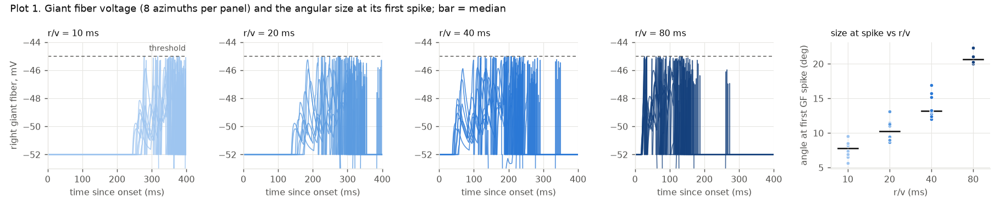
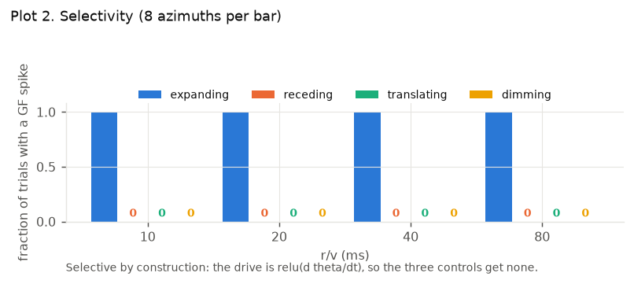
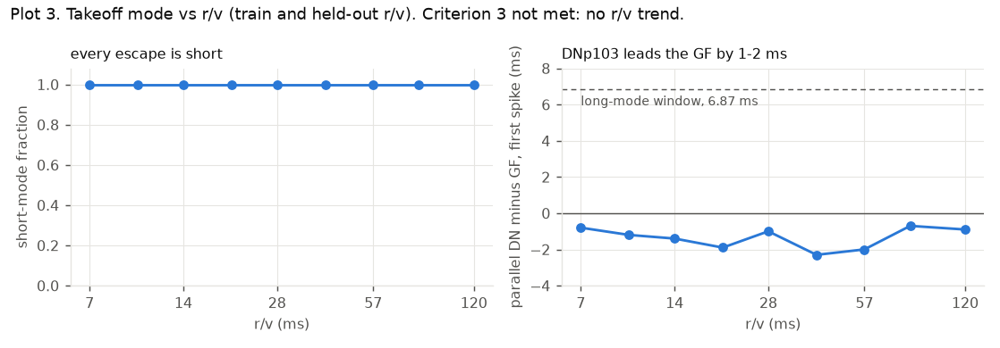
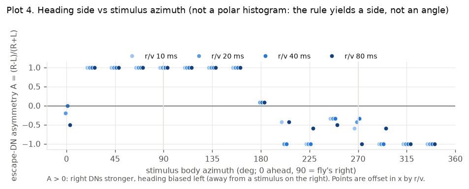
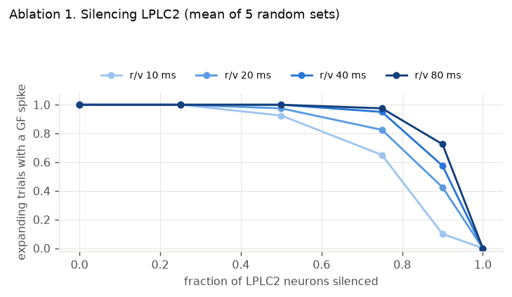
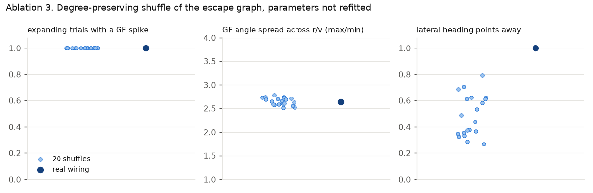

# Validation (v1, Week 2)

Reproduce everything here from `offline/validation.py` (parts `main`, `lplc2`,
`shuffle`, `shuffle_heading`, then `report`; about 15 minutes on three GPUs) and
`offline/heading.py`. Raw numbers: `docs/validation.json`; figures:
`docs/figures/`. Parameters are the three chosen by `lif_fit.py`
(`docs/lif_fit.md`), provisional until the Brian2 check.

## Read this first

**The looming detection in this model is a model component, not a result about
the fly.** The optic lobe could not separate translating from looming discs under
any parameter setting (`docs/week1_gate.md`), so LPLC2 is driven by the stimulus's
angular growth, relu(d theta / dt). Plots 1 and 2 therefore show the connectome
circuit behaving sensibly downstream of a detector we supplied; they do not show
that the fly's visual system discriminates. The game UI has to say the same.

## Plots

| # | Plot | Criterion | Status | Figure |
| --- | --- | --- | --- | --- |
| 1 | GF voltage by r/v, and angle at the first GF spike vs r/v | 2 | done | `plot1_gf_voltage_and_angle.png` |
| 2 | GF spike fraction: expanding, receding, dimming, translating | 1 | done | `plot2_selectivity.png` |
| 3 | Short-mode fraction vs r/v | 3 | done, **criterion not met** | `plot3_mode_vs_rv.png` |
| 4 | Heading vs stimulus azimuth | 4 | done as a side index, not a polar histogram | `plot4_heading_side.png` |
| 5 | Escape probability vs human strike r/v, from game logs | game target | needs the game | n/a |

- **Plot 1.** The giant fiber's first spike comes at angles of 7.8 / 10.2 / 13.2 /
  20.6 degrees for r/v 10 / 20 / 40 / 80 ms (median over 8 azimuths), so the
  angle is not constant: the largest-to-smallest ratio is 2.6, and it rises with
  r/v at every one of the 206 settings that pass criterion 1. No published curve
  is overlaid: whether the real GF threshold angle rises with r/v has not been
  checked against the papers, so do not read this as agreement or disagreement.
- **Plot 2.** Expanding: GF spike in every trial at every r/v; receding,
  translating and dimming: none. Selective by construction (above).
- **Plot 3.** Every escape is short-mode at every r/v, train and held-out. The
  plan's trend (short fraction rising as r/v falls) is not reproduced and the
  figure says so. Cause in `docs/lif_fit.md`: DNp103 and the GF are co-driven and
  DNp103 leads by 1 to 2 ms, far inside the 6.87 ms window.
- **Plot 4.** The rule yields a side, not an angle, so a polar histogram of
  heading would be invented. The figure plots the left/right asymmetry index
  against stimulus azimuth: stimuli on the right give A = +1 or near it and
  stimuli on the left give negative A (48 of 48 lateral trials point away, see
  `docs/heading.md`). Ahead and behind give about 0.

## Ablations

Each mirrors a published silencing result where one exists. All are run at the
fixed chosen parameters, without refitting.

| Condition | Published result | Expected here | Result | Status |
| --- | --- | --- | --- | --- |
| LPLC2 silenced | Fewer GF-mediated escapes (Ache et al. 2019) | Short-mode fraction drops | see below | run, offline |
| GF silenced | Flies caught more by damselflies (Chai et al. 2025) | Higher human hit rate, fast strikes most | needs human play | not run |
| Shuffled wiring, degree-preserving | none | Looming selectivity collapses | see below | run, offline |
| Distance-threshold bot | baseline only | Escapes depend on distance alone | see below | closed-form comparison |

**LPLC2 silenced** (`ablation1_lplc2.png`; random subsets of the 91 driven LPLC2
neurons lose their drive and never spike, 5 subsets per fraction). The expanding
trials with a GF spike are, by fraction silenced: 0 to 25%: all of them; 50%:
97.5%; 75%: 85%; 90%: 46%; 100%: none. The loss is graded and falls first at the
fastest looms (at 90% silenced, 10% of r/v 10 trials and 73% of r/v 80 trials still
spike). The plan's "short-mode fraction drops" is not testable because there is
no long mode (criterion 3). Silencing everything silences the circuit trivially,
because LPLC2 is the only driven input here; LC4 receives no optic input.

**Shuffled wiring** (`ablation3_shuffle.png`; 20 degree-preserving edge shuffles of
the 42,396-edge escape graph, in- and out-degree of every neuron kept, weights
travel with their edge). The plan expected looming selectivity to collapse. It
does not, and that is a finding about this model:

- Expanding GF fraction stays 1.0 in all 20 shuffles and the controls stay at 0;
  the GF angle spread stays 2.5 to 2.8 (2.64 with real wiring). **Criteria 1 and
  2 do not depend on the connectome's specific wiring.** Any wiring with these
  degrees passes, because the angular drive is strong and selective and the
  circuit is dense. They are therefore not evidence that the wiring does anything.
- Heading does depend on it: the fraction of lateral stimuli whose heading points
  away falls from 1.00 to 0.49 on average (range 0.27 to 0.79) under shuffles, and
  the first DN to spike is on the stimulus side in 0.50 on average (0.27 to 0.79),
  chance. **The connectome's side-specific wiring is what makes criterion 4 hold.**

**Distance-threshold bot** (closed form from the chosen-parameter run, swatter
half-width 50 mm, bot distance set to the circuit's at r/v 20, 562 mm). The
circuit's trigger distance is 734 / 562 / 432 / 275 mm at r/v 10 / 20 / 40 / 80,
a factor of 2.7 between the fastest and slowest loom, and time to collision at
the trigger is 147 / 225 / 345 / 440 ms. A fixed-distance bot gives 112 / 225 /
449 / 899 ms for the same looms. Both are monotone in r/v, so on a speed sweep at
fixed swatter size they are distinguishable by degree, not by kind. The difference
that is one of kind: the circuit's response depends on r/v alone, so its trigger
distance scales with the swatter's size; a fixed-distance bot's does not. A
swatter-size sweep in the game is the clean test. **Not yet shown:** that human
players' hit rate differs between the circuit and the bot.

## Limitations to state

These are already known and belong here as well as in the UI:

- The looming detector is supplied, not derived (top of this file).
- Point-neuron LIF. Real neurons are not point neurons.
- No electrical synapses. This one matters most: the GF's fastest inputs are
  electrical and EM records them poorly, which is why its strongest recorded
  inputs are DNp70, PVLP010 and SAD neurons rather than the visual detectors.
  The chemical path into the GF is incomplete, so the fit compensates for a known
  deficit.
- No takeoff-mode selection: every escape is short-mode (criterion 3).
- Heading from DN left/right asymmetry, not pre-takeoff leg posture, and only a
  side: front and back are undetermined. The plan labels this a simplification and
  so does the UI.
- LPLC2 and LC4 are left/right asymmetric in MaleCNS (94/91 and 71/55 bodies),
  from incomplete reconstruction. The right side saturates in the heading test while
  the left is graded, which may partly reflect this; the two sides are not
  normalised.
- The angle at the GF spike rises with r/v and is not constant; whether that
  matches the published GF is unchecked.
- The three parameters are provisional: the Brian2 code check is not done, and
  criterion 1 constrains them only weakly.
- Monocular drive in the fit and gate runs; bilateral only in `heading.py`.
